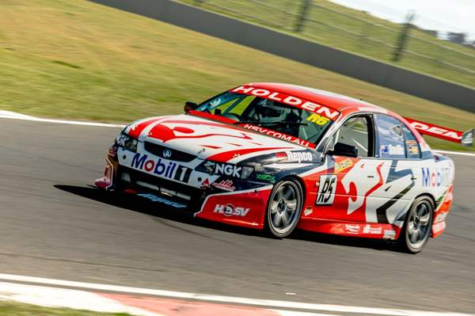
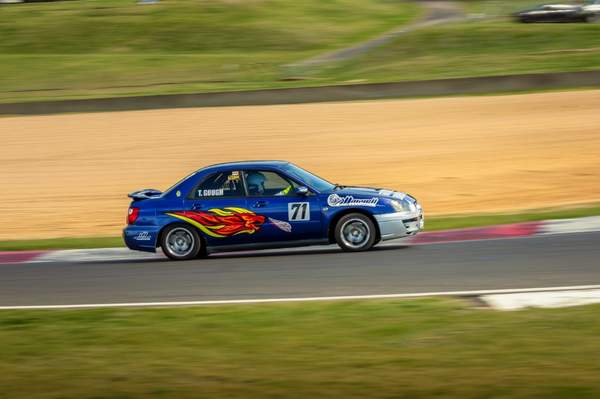
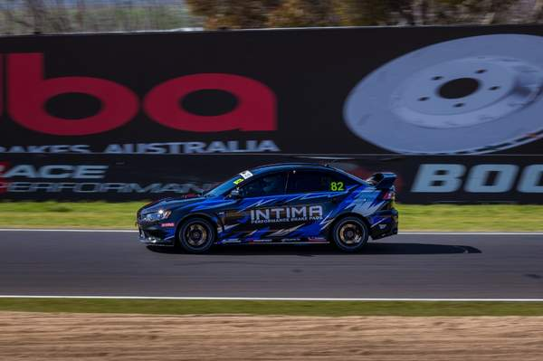

# Conrod

Fast vehicle keywording and culling for motorsport and automotive photography.

Conrod scans folders of RAW and JPEG frames to detect vehicles and people, measure subject sharpness, pick the best frame of each burst, read race numbers and plates, and identify make, model, and colour. Tags are written directly into industry-standard XMP sidecars for Lightroom, Photo Mechanic, Bridge, and Capture One.

Conrod is a native Windows app built with Rust, Tauri, and React. (The legacy Python release lives on the [`legacy-python`](../../tree/legacy-python) branch).

## Installation

Download the latest release from [Releases](../../releases):
- **Installer** (`Conrod-<v>-win64-setup.exe`): Per-user installation, no admin rights required.
- **Portable** (`Conrod-<v>-win64.zip`): Unzip and launch `Conrod.exe`.

*Note: Builds are not code-signed; Windows SmartScreen will ask for confirmation on first launch.*

### Setup & Requirements
- **Batteries included**: Bundled models and ExifTool ship with the app or download automatically on first run.
- **Optional Local AI**: Install [Ollama](https://ollama.com/) and run `ollama pull qwen2.5vl:7b` for local make/model/colour identification. (Cloud OpenAI / GPT-4o is also supported in Settings).
- **Existing Users**: Libraries in `%USERPROFILE%\.conrod` (database, settings, trained models) open automatically.

## Key Features

- **Non-destructive**: RAW files are never modified; metadata is written to `.xmp` sidecars. JPEGs update in place.
- **Burst Culling**: Identifies identical cars through bursts and picks the sharpest keeper of each pass.
- **Trainable Sharpness**: Customizes subject scoring to your photography style (e.g. sharp car on panning motion blur) using user ratings in the Train tab.
- **Entry List Matching**: Drop in an event entry CSV (`number,driver,team,...`) to guarantee accurate keywords for competitors. (See [`samples/entries-example.csv`](samples/entries-example.csv)).
- **Folder Watch**: Automatically processes new frames as they copy from memory cards.
- **Formats**: Tested on Canon `.cr3` and `.cr2`, alongside `.jpg` / `.jpeg`.

## Models & Pipeline

Each stage uses a dedicated, specialized model rather than a single monolithic multimodal model:

| Task | Model | Purpose |
|---|---|---|
| Vehicle Detection | YOLO11s (DirectML / GPU) | Fast bounding boxes (~17ms/frame) |
| Plate Detection | open-image-models | License plates & number roundels |
| Plate OCR | fast-plate-ocr | Dedicated plate character recognition |
| Livery & Numbers | PP-OCRv4 | Competition numbers and sponsor decals |
| Burst Grouping | DINOv2 (quantized) | Visual similarity clustering |
| Make, Model, Livery | Qwen2.5-VL 7B (via Ollama) | Vehicle visual identification |

### Why Qwen2.5-VL 7B?

Tested against real circuit photography using Conrod's structured extraction prompt and schema:

| Target | Ground Truth | qwen2.5vl:7b (Local Ollama) | gpt-4o (OpenAI Cloud) |
|---|---|---|---|
| <br>*(Holden HRT)* | **Holden Commodore (VY/VZ)**<br>#R5, Saville<br>HRT / Mobil 1, HSV, Repco, NGK | **Make**: Holden, **Model**: HSV<br>**Number**: `R5` ✅<br>**Sponsors**: Mobil 1, NGK, Repco, HSV, Xbox ✅ | **Make**: Holden, **Model**: *null* ❌<br>**Number**: `05` ❌ *(hallucinated Brock)*<br>**Driver**: `Brock` ❌ *(hallucinated)* |
| <br>*(Subaru WRX)* | **Subaru Impreza WRX STI (Blobeye)**<br>#71, T. Gough<br>Marvell | **Make**: Subaru ✅, **Model**: Impreza ✅<br>**Number**: `71` ✅<br>**Driver**: `T. Gough` ✅ | **Make**: *null* ❌, **Model**: *null* ❌<br>**Number**: `71` ✅<br>**Driver**: `T. Gough` ✅ |
| <br>*(Lancer Evo X)* | **Mitsubishi Lancer Evolution X**<br>#82<br>Intima, Motul, Shockworks, Tyrepower | **Make**: Mitsubishi ✅, **Model**: Lancer Evolution ✅<br>**Number**: `82` ✅<br>**Sponsors**: Intima, Motul ✅ | **Make**: *null* ❌, **Model**: *null* ❌<br>**Number**: `82` ✅<br>**Sponsors**: Intima, Motul, Yokohama ✅ |

*Other local models tested:* `minicpm-v:8b` hallucinated a Mustang; `gemma3:4b` hallucinated a Mazda 323; `qwen3-vl:8b` failed JSON output structure. `qwen2.5vl:7b` identifies silhouettes accurately and runs locally in ~3.4s on an RTX 3070 Ti.

## Development & Build

Prerequisites: Rust (MSVC), C++ Build Tools, Node.js, and WebView2.

```powershell
# Install frontend dependencies
npm --prefix frontend ci

# Run development app
npm --prefix frontend run tauri -- dev

# Run tests and lints
cargo test --workspace
cargo clippy --workspace --all-targets -- -D warnings
npm --prefix frontend test

# Compile release installer
npm --prefix frontend run tauri -- build --ci
```

Output installer: `target/release/bundle/nsis/`.

See [`API.md`](API.md) for the internal command API and [`RELEASING.md`](RELEASING.md) for release workflows.

## Licensing

Detection uses Ultralytics YOLO (**AGPL-3.0**). Plate detection is **MIT**. Full third-party licenses and model hashes are tracked in [`scripts/assets.json`](scripts/assets.json).
